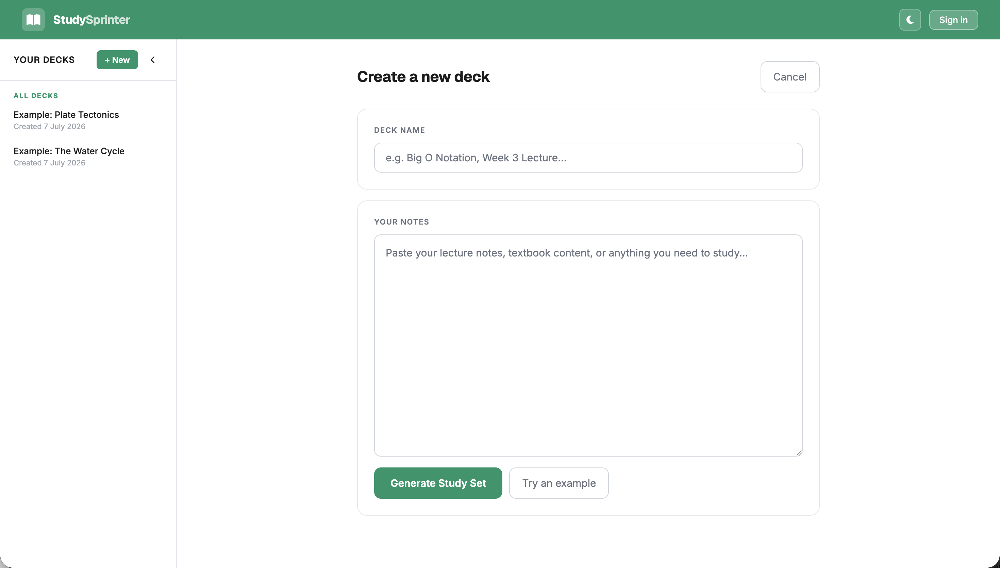
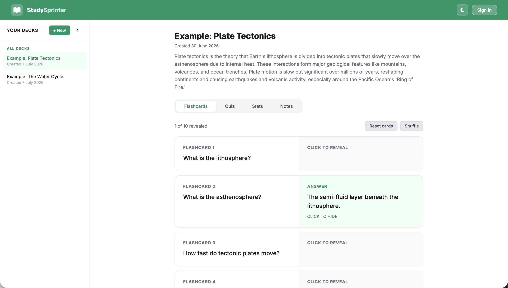
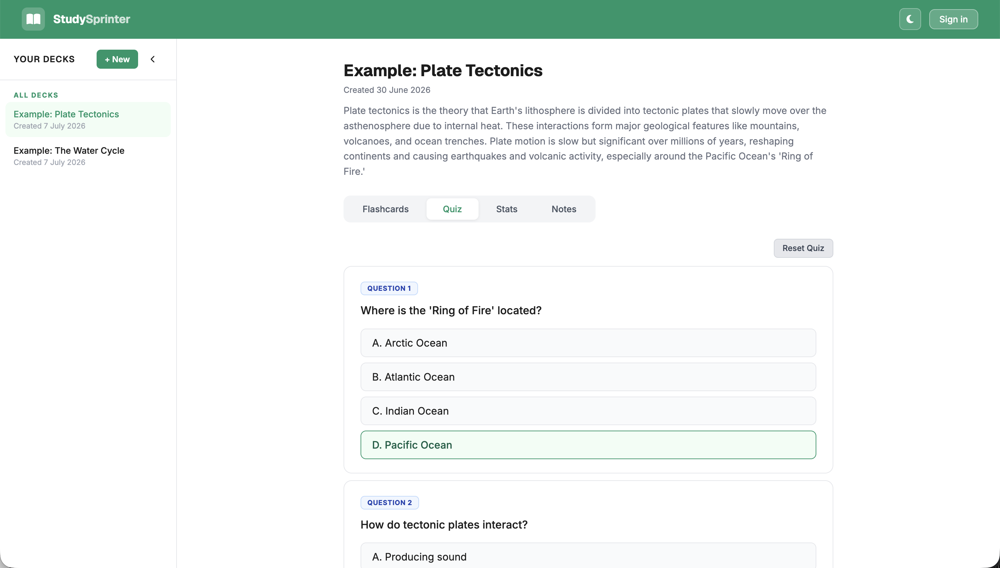
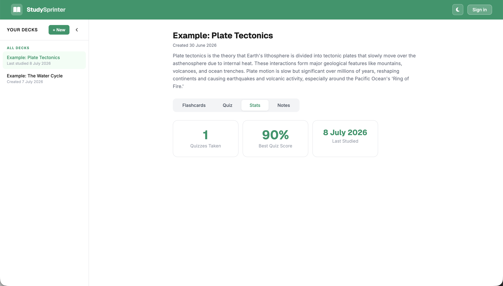
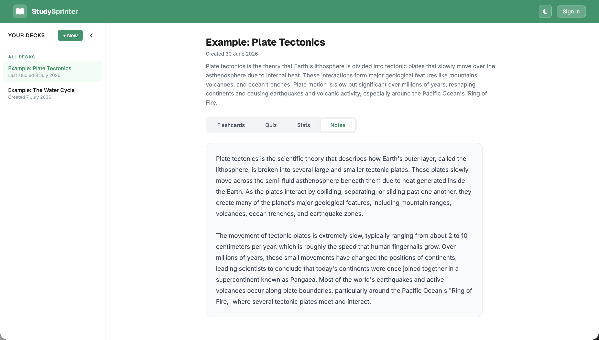

Hi, Anna , 
Can you check Sign up/sign in not working - connect me if possible ?
# StudySprinter

Turn your notes into flashcards and quizzes instantly.

**Live demo:** https://studysprinter.vercel.app

StudySprinter is a full-stack AI study app. Paste in your notes, and it generates a set of flashcards, a multiple-choice quiz, and a summary for you to study from. Use it instantly as a guest with example decks, or sign in for your own private account with saved decks, progress, and stats.

## Screenshots

**Paste your notes and generate a study set**


**Review your AI-generated flashcard deck**


**Take a quiz, with shuffled questions on every attempt**


**Track your progress across decks**


**Revisit your original notes alongside the generated content**


## Features

- AI-generated flashcards, quizzes, and summaries from pasted notes (OpenAI GPT-4)
- Guest mode: try it instantly with example decks, no account required; create your own decks as a guest and they migrate to your account when you sign up
- Google and email/password authentication, with password reset and account deletion
- Private, per-user data: your decks are only visible to you
- Quiz scoring with shuffled question and answer order on every attempt
- Per-deck stats: quizzes taken, best score, last studied
- Pin decks, dark mode, fully responsive on mobile
- Notes tab to revisit your original material alongside the generated content

## Tech stack

- **Frontend:** React, deployed on Vercel
- **Backend:** FastAPI (Python), deployed on Render
- **Database & Auth:** Supabase (PostgreSQL, Google OAuth + email/password)
- **AI:** OpenAI API (GPT-4)

## Architecture

```
React (Vercel)  →  FastAPI (Render)  →  Supabase (PostgreSQL + Auth)
                                      →  OpenAI API
```

The backend verifies every request with a Supabase-issued JWT, so each user only ever sees their own data. Decks are linked to users with a cascading foreign key, so deleting an account also cleanly deletes everything tied to it.

## Running locally

**Backend**

```bash
cd backend
python -m venv venv
source venv/bin/activate
pip install -r requirements.txt
uvicorn main:app --reload
```

You'll need a `.env` file in `backend/` with:

```
OPENAI_API_KEY=your_key
SUPABASE_URL=your_supabase_url
SUPABASE_SERVICE_KEY=your_supabase_service_role_key
```

**Frontend**

```bash
cd frontend
npm install
npm start
```

You'll need a `.env` file in `frontend/` with:

```
REACT_APP_BACKEND_URL=http://localhost:8000
REACT_APP_SUPABASE_ANON_KEY=your_supabase_anon_key
```
